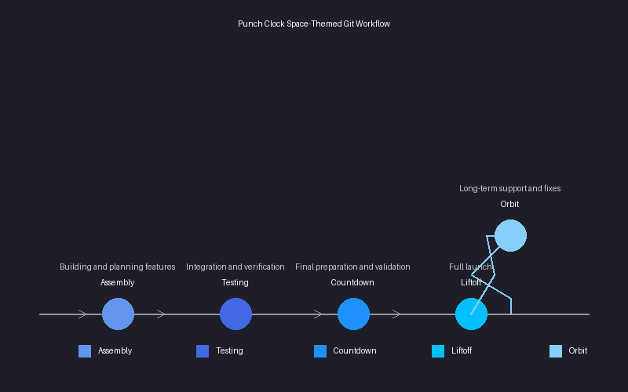
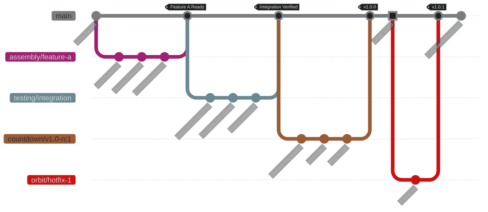

# Space-Themed Git Workflow

The Punch Clock project follows a space-themed Git workflow that organizes our development process into distinct stages with clear transitions.

## Workflow Stages

Our development process follows these five key stages:

| Stage | Branch Prefix | Purpose | Description |
|-------|--------------|---------|-------------|
| **Assembly** | `assembly/*` | Development | Building and planning features |
| **Testing** | `testing/*` | Staging | Integration and verification |
| **Countdown** | `countdown/*` | UAT | Final preparation and validation |
| **Liftoff** | `liftoff` | Production | Full launch |
| **Orbit** | `orbit/*` | Maintenance | Long-term support and fixes |



## Workflow Visualization



## Stage Details

### 1. Assembly Stage

The Assembly stage is where new features are built, planned, and initially developed.

**Key Characteristics:**
- Initial development of new features
- Experimental changes
- Research and prototyping
- Individual components development

**Branch Convention:**
```
assembly/feature-name
assembly/add-export-feature
assembly/redesign-dashboard
```

**Exit Criteria:**
- Feature is complete and working as expected in isolation
- Basic unit tests are passing
- Code has been reviewed by at least one team member

### 2. Testing Stage

The Testing stage is where features are integrated and thoroughly verified.

**Key Characteristics:**
- Integration of multiple features
- System testing across components
- Performance and load testing
- User acceptance testing by internal team

**Branch Convention:**
```
testing/feature-integration
testing/sprint-5-features
testing/v1.2-components
```

**Exit Criteria:**
- All integrated features work together
- Integration tests are passing
- Performance meets requirements
- No critical issues found

### 3. Countdown Stage

The Countdown stage is the final preparation before release, focused on validation and polish.

**Key Characteristics:**
- Release candidate preparation
- Final bug fixes
- Documentation completion
- Deployment preparation

**Branch Convention:**
```
countdown/v1.2.0-rc1
countdown/2025-q2-release
countdown/sprint-6-release
```

**Exit Criteria:**
- All release blockers resolved
- Documentation is complete
- Deployment plan is approved
- Final sign-off from stakeholders

### 4. Liftoff Stage

The Liftoff stage represents the production release of the software.

**Key Characteristics:**
- Production deployment
- Version tagging
- Release notes publication
- User announcements

**Branch Convention:**
```
liftoff (main branch)
```

**Post-Liftoff Process:**
- Monitor deployment
- Address any immediate issues
- Collect initial feedback
- Tag release version

### 5. Orbit Stage

The Orbit stage covers maintenance, support, and critical fixes after release.

**Key Characteristics:**
- Bug fixes
- Security patches
- Minor enhancements
- Long-term support

**Branch Convention:**
```
orbit/hotfix-time-calculation
orbit/security-patch-may2025
orbit/performance-improvement
```

**Process:**
- Hotfixes branch from liftoff
- Changes are tested thoroughly
- Merged directly to liftoff and relevant branches
- Tagged as patch releases

## Workflow Text Representation

```
assembly/feature-x  →→→→→→→→
                          ↓
                     Code Review
                          ↓
testing/integration  →→→→→→→→→
                          ↓
                    Final Testing
                          ↓
countdown/v1.x.0-rc1 →→→→→→→→→
                          ↓
                    Release Approval
                          ↓
liftoff (main)       →→→→→→→→→
     ↑                     ↓
     ╰────────────────────╯
       orbit/hotfix
```

## Best Practices

1. **Always branch from the correct stage**
   - Features branch from assembly
   - Integration branches from testing
   - Release preparation from countdown
   - Hotfixes from liftoff

2. **Clear, descriptive branch names**
   - Include the stage prefix
   - Use descriptive names that explain the purpose
   - Use kebab-case for readability

3. **Regular integration**
   - Merge upstream changes frequently
   - Resolve conflicts promptly
   - Test after every significant merge

4. **Complete transitions**
   - Ensure all exit criteria are met before advancing
   - Document any exceptions or special circumstances
   - Get appropriate approvals for stage transitions

## Handling Emergencies

For urgent production issues:

1. Create an `orbit/hotfix-description` branch from `liftoff`
2. Fix the issue and test thoroughly
3. Merge directly to `liftoff` after approval
4. Backport the fix to other relevant stages as needed
5. Tag as a patch release (e.g., v1.2.1)

## Tools and Automation

Our workflow is supported by CI/CD tools that:

- Automatically run tests for each branch
- Flag issues before they reach the next stage
- Provide deployment previews
- Automate release processes